# 🎵 Musiccu

**Musiccu** is a feature-rich Flutter music player app that allows users to play, manage, and organize their music seamlessly. With support for playlists, queue management, background playback, and beautiful UI animations, Musiccu offers a smooth and interactive listening experience.

---

## 🌟 Features

* Play songs from local storage
* Queue management: add, delete, reorder songs
* Repeat and shuffle modes
* Most played & recently played tracking
* Playlist management: create, update, delete playlists
* Add multiple songs to multiple playlists at once
* Favorite songs and playlists
* UI enhancements:
  * Dark/light mode
  * Animations: scrolling text, image rotation, sliders
  * Bottom sheet for playlist actions
  * Snackbars for feedback
* Background audio playback with notifications
* Supports both Android and iOS

---

## 💻 Tech Stack

* **Language & Framework:** Dart, Flutter
* **Audio:** `just_audio`, `audio_service`, `audio_session`
* **State Management:** `get`
* **UI Components:** `carousel_slider`, `sliding_up_panel`, `flutter_slidable`, `shimmer`, `marquee`
* **Local Storage:** `hive`, `hive_flutter`
* **File & Media Handling:** `path_provider`, `file_picker`, `flutter_media_metadata`, `media_store_plus`, `dart_tags`
* **Fonts & Icons:** `google_fonts`, `font_awesome_flutter`, `flutter_svg`, `cupertino_icons`

---

## ⚙️ Installation

1. Clone the repository:

```bash
git clone https://github.com/itadoridesu/musiccu_appu.git
````

2. Navigate to the project directory:

```bash
cd musiccu_appu
```

3. Install dependencies:

```bash
flutter pub get
```

4. Run the app:

```bash
flutter run
```

> Make sure you have Flutter installed and your device/emulator ready.

---

## 🗂 Folder Structure

Feature-First Structure

```
lib/
├── bindings/               # Dependency injections and bindings (GetX)
├── common/                 # Shared widgets & styles
│   ├── styles/
│   └── widgets/
├── data/                   # Data layer
│   ├── dummy_data/
│   ├── repositories/
│   └── services/
├── features/               # Feature modules
│   ├── authentication/     # Login & Sign-up
│   │   ├── controllers/
│   │   ├── models/
│   │   └── screens/
│   ├── musiccu/            # Main music functionality
│   │   ├── controllers/
│   │   │   ├── audio/
│   │   │   ├── playlist/
│   │   │   └── ui_controllers/
│   │   ├── models/
│   │   │   ├── playlist_model/
│   │   │   └── song_model/
│   │   └── screens/
│   │       ├── now_playing/
│   │       │   └── widgets/
│   │       │       ├── no_lyrics_layout/
│   │       │       └── yes_lyrics_layout/
│   │       ├── playlists/
│   │       │   ├── inside_playlist/
│   │       │   │   └── widgets/
│   │       │   └── widgets/
│   │       ├── queue/
│   │       │   └── widgets/
│   │       └── songs/
│   │           └── widgets/
│   └── personalization/    # User customization features
│       ├── controllers/
│       ├── models/
│       └── screens/
│           ├── update_playlist.dart
│           └── update_song/
│               └── widgets/
├── routes/                 # App route definitions
└── utils/                  # Helper functions & constants
    ├── constants/
    ├── device/
    ├── exceptions/
    ├── formatters/
    ├── helpers/
    ├── http/
    ├── local_storage/
    ├── logging/
    ├── popups/
    ├── theme/
    │   └── custom_theme/
    └── validators/
```

---

## 📸 Demo / Screenshots

### 📃 Songs

* Songs List 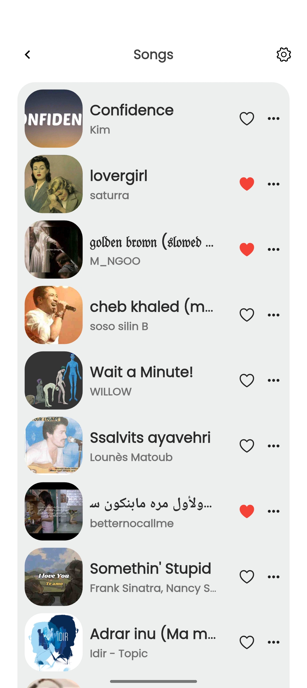

### 🎶 Queue

* Queue Screen 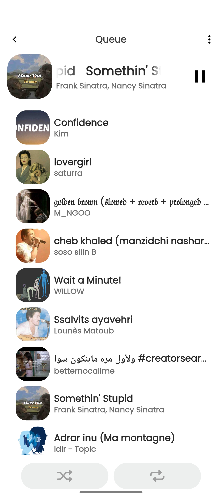
* Queue Song Positioning 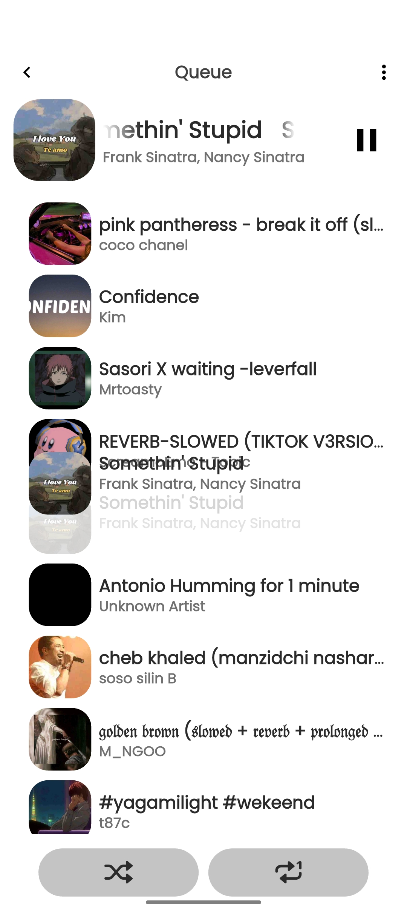
* Remove Song from Queue 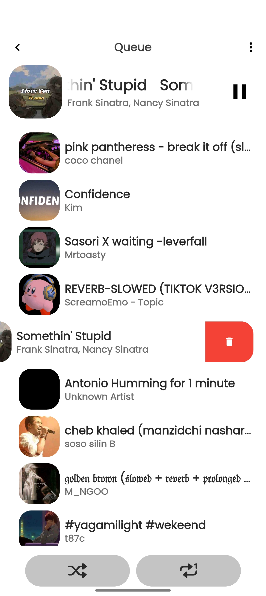
* Queue Shuffle On 

### 🎵 Playlists

* Most Played Playlist 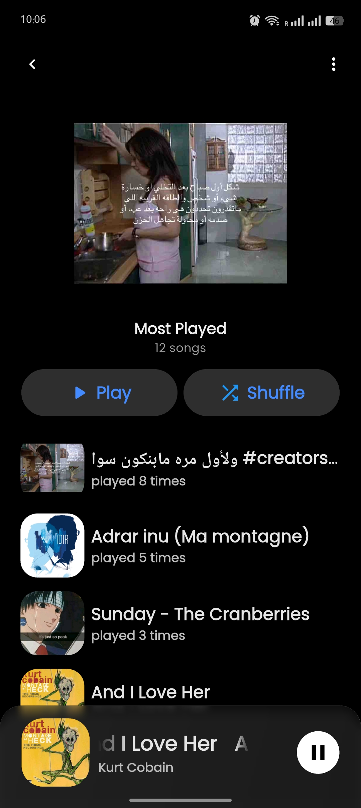
* Add Song to Playlist 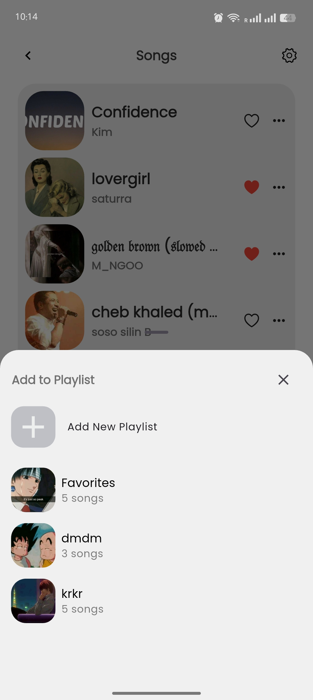
* Delete Playlists 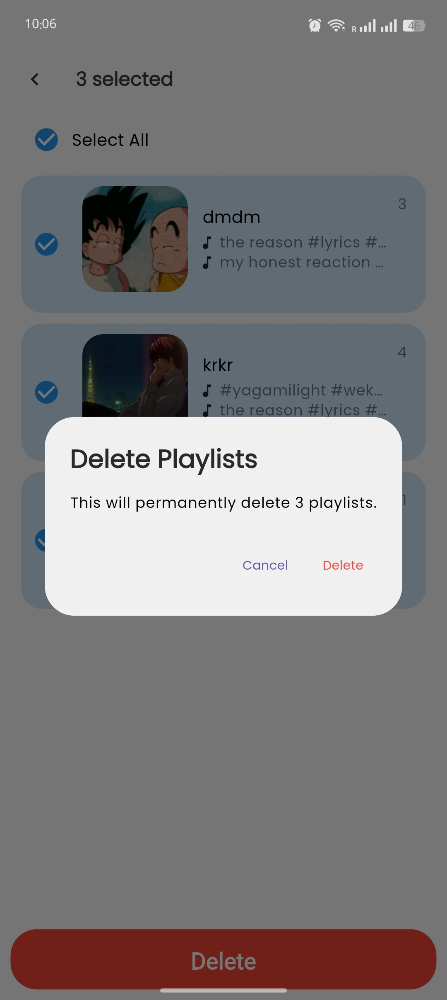
* Many Songs to Many Playlists 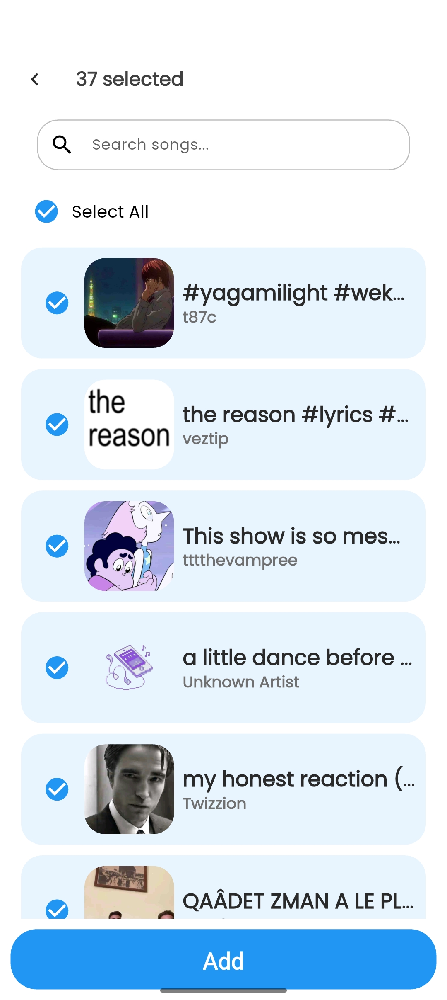
* Select Playlists Options 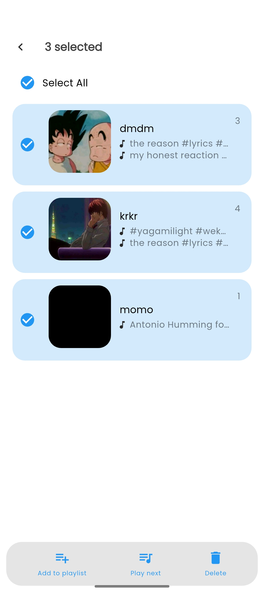
* Playlists Deleted Snackbar 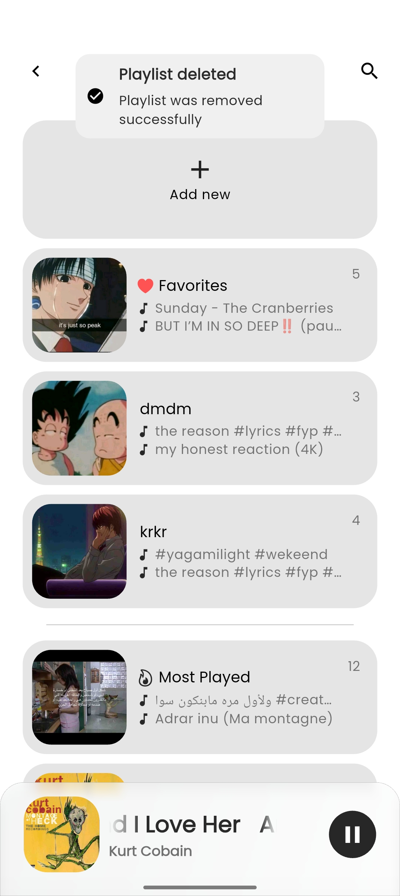

### 🎤 Now Playing

* Song Playing 
* Song Playing Repeat1 Mode 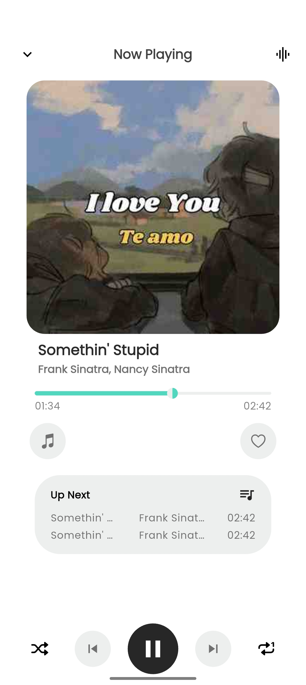
* Lyrics Screen 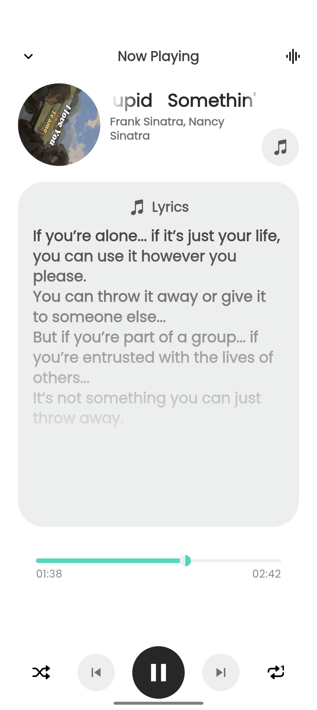
* Song Options 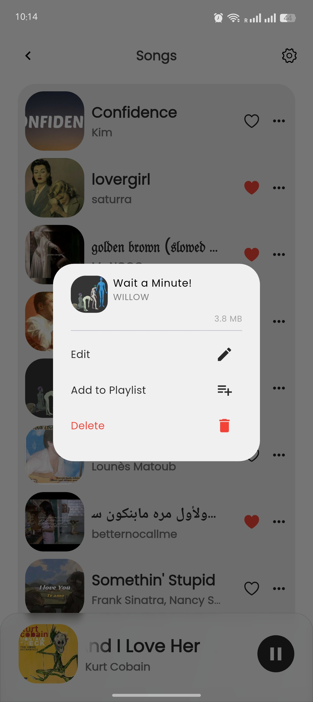
* Song Imported 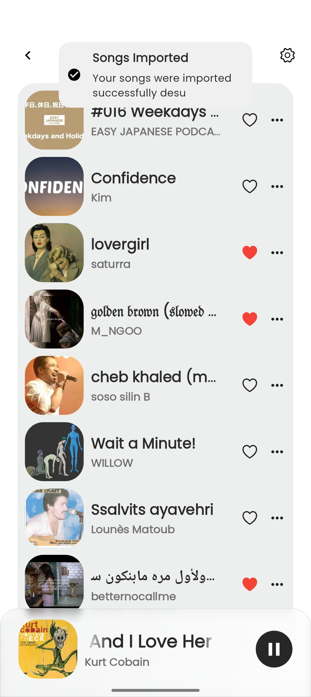

### ⚙️ Settings

* Settings Screen 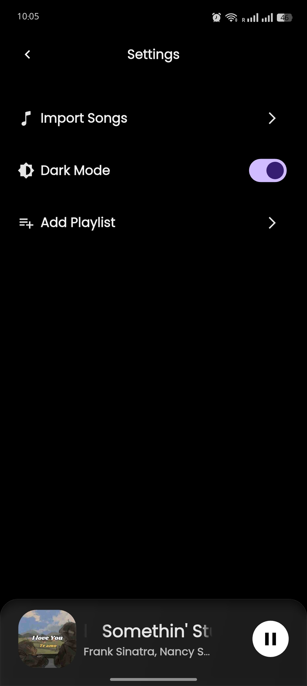

---

## ✉️ Author

Adem Hamizi
Email: [adem.hamizi@lau.edu](mailto:adem.hamizi@lau.edu)
Phone: +213 796550612

GitHub: [itadoridesu](https://github.com/itadoridesu)
